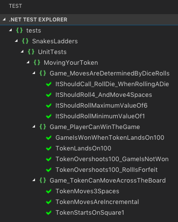

# snakes-and-ladders-kata-c-sharp

Solution to the Snakes and Ladders Kata at http://agilekatas.co.uk/katas/SnakesAndLadders-Katain (in C#)

My first solution to this Kata can be found [here](https://github.com/jonurry/snakes-and-ladders-kata) (using `Node.js`). As an additional exercise, I also solved the Kata using C# which can be seen in this repository.

**Note:** Currently only implemented Feature 1 of 4 - _Moving Your Token_

## Approach

I knew that I wanted to test-drive my solution so following a `test-driven development` approach was essential. I used the `red, green, refactor` TDD approach where you write a failing test, implement code to pass the test and then refactor to keep the code clean and as simple as possible.

## Design Decisions

I chose to implement this solution in `C#` using `.Net Core`, `xUnit` and `Moq` in `VS Code`. I know that C# is the preferred language for the company that this tech test is for so I wanted to stretch myself and do something that I was a lot less familiar with.

The structure of the code is very simple. There is one solution containing two projects. The single source code file (`Game.cs`) is located in the `snakes-ladders` directory and the three test files are located in the `tests` directory. I saw no need for anything more complicated at this stage.

## Problems

Although I had done a bit of C# a long time ago this was all pretty new to me. I hadn't used `VS Code` for `C#` before and I hadn't done any Microsoft based development natively on a Mac before. It took me a while to set up the project, install the dependencies and get the first test running. I had a really annoying problem where the tests wouldn't compile and I couldn't work out why. Eventually, I terminated `VS Code` and reloaded it again. This fixed the issue.

It also took me some effort to get the stubbing to work. I'm not entirely happy with the end result. I think it gets me a lot of the way towards where I wanted to be but ideally, I would have been able to stub the Random.Next() method directly. Instead, I had to inject a `RandomDieRoller` into the `Game` class and stub that. I would be interested to find out how to do this properly as it is relatively easy in `JavaScript` or `Ruby` using their mocking frameworks.

## The Future

I wanted to keep the solution simple and not worry about future features. This is why there's only one class in the project, the `Game` class. At this point in time, I saw no need to make it any more complicated than that. Once players are introduced I would expect the class model to expand to at least include a `Player` class.

## Installation

### Prerequisites

The project requires `VS Code` and the `.NET Core SDK` to be installed on your computer.

1. Install [Visual Studio Code](https://code.visualstudio.com/)

2. Install the [.NET Core SDK](https://www.microsoft.com/net/download/core)

3. Install the [C# extension](https://marketplace.visualstudio.com/items?itemName=ms-vscode.csharp) for Visual Studio Code

To get the project code, please enter the following command in the terminal:

```
git clone git@github.com:jonurry/snakes-and-ladders-kata-c-sharp.git
```

then, change to the newly created code directory:

```
cd snakes-and-ladders-kata-c-sharp
```

To build the project, please enter the following command in the terminal:

```
dotnet build
```

The projects use the following dependencies:

- `Microsoft .NET SDK targeting Core 2.2` for running the app code

- `xunit` for testing

- `moq` for mocking dependencies in unit tests

- I also use a test runner extension in VS Code

## Tests

To run all of the tests, please enter the following command in the terminal:

```
dotnet test
```

If you have the dot net test explorer installed you can run the tests there.

Here's what to expect when you run the tests in the test runner:


